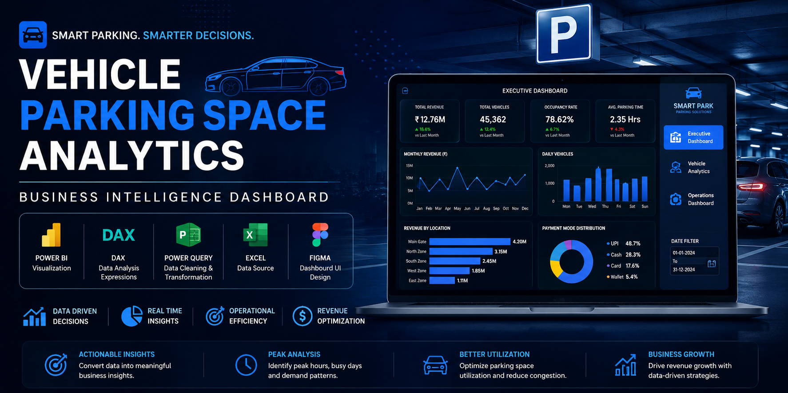

<p align="center">
  
</p>

<h1 align="center">🚗 Vehicle Parking Space Analytics</h1>

<p align="center">
  <strong>Business Intelligence Dashboard | Power BI | DAX | Power Query | Excel | Figma</strong>
</p>

<p align="center">
A Business Intelligence solution developed during my <strong>Data Analytics Internship</strong> to transform raw parking transaction data into actionable insights for operational optimization, revenue analysis, and data-driven decision-making.
</p>

---

# 📖 Project Overview

Vehicle Parking Space Analytics is an end-to-end **Business Intelligence solution** developed using **Power BI** to analyze parking operations and business performance.

The project converts raw parking transaction data into meaningful insights through interactive dashboards, enabling stakeholders to monitor revenue trends, parking utilization, customer behavior, and operational efficiency.

Developed during my **Data Analytics Internship**, this project demonstrates the complete Business Intelligence workflow—from data preparation and transformation to dashboard development and business insight generation.

---

# 🎯 Business Problem

Parking facilities generate thousands of transactions every day. However, without proper analytics, management faces several challenges:

- Difficulty in monitoring revenue performance.
- Limited visibility into parking occupancy.
- Inability to identify peak parking hours.
- Lack of insights into customer and vehicle trends.
- Manual reporting that consumes time.
- Decision-making based on assumptions instead of data.

Traditional reports provide historical data but fail to deliver interactive insights required for strategic planning.

---

# 💡 Solution

To address these challenges, I designed and developed a complete Business Intelligence dashboard using **Power BI**.

The solution includes:

- Data Cleaning & Transformation using **Power Query**
- Data Modeling
- KPI Development using **DAX**
- Interactive Dashboard Development
- Executive Reporting
- Custom Dashboard UI designed in **Figma**
- Dynamic Filtering & Drill-down Analysis

The dashboard enables management to monitor business performance in real time and make faster, data-driven decisions.

---

# 📊 Dashboard Modules

## 📌 Executive Dashboard

Provides an executive-level overview of business performance.

**Key Visuals**

- Total Revenue
- Total Vehicles
- Occupancy Rate
- Average Parking Duration
- Monthly Revenue Trend
- Daily Vehicle Count
- Revenue by Location

---

## 🚘 Vehicle Analytics

Provides detailed analysis of customer and vehicle behavior.

**Key Visuals**

- Vehicle Type Distribution
- Customer Type Analysis
- Payment Mode Distribution
- Parking Duration Analysis
- Revenue by Vehicle Category

---

## ⚙️ Operations Dashboard

Focuses on operational efficiency and parking utilization.

**Key Visuals**

- Peak Parking Hours
- Floor-wise Occupancy
- Parking Slot Utilization
- Operational Performance Metrics

---

# 📈 Key Performance Indicators (KPIs)

- Total Revenue
- Total Vehicles
- Occupancy Rate
- Average Parking Duration
- Revenue per Vehicle
- Average Ticket Value
- Peak Parking Hour
- Peak Parking Day
- Customer Distribution
- Payment Analysis
- Parking Utilization

---

# 🔍 Key Business Insights

This dashboard helps management to:

- Identify high-demand parking periods.
- Analyze monthly revenue growth.
- Optimize parking space utilization.
- Understand customer behavior.
- Analyze preferred payment methods.
- Monitor operational efficiency.
- Improve decision-making using KPI-driven reporting.

---

# 📌 Business Impact

The dashboard supports data-driven decision-making by enabling management to:

- Optimize parking space allocation.
- Improve staffing during peak hours.
- Monitor revenue performance.
- Reduce manual reporting efforts.
- Improve operational efficiency.
- Enhance customer experience.
- Make faster and more informed strategic decisions.

---

# 🛠 Technology Stack

| Technology | Purpose |
|------------|---------|
| Power BI | Dashboard Development & Visualization |
| DAX | KPI & Measure Development |
| Power Query | Data Cleaning & Transformation |
| Microsoft Excel | Data Source |
| Figma | Dashboard UI Design |

---

# 👩‍💻 My Contributions

During this internship project, I was responsible for:

- Designing the complete dashboard interface in **Figma**.
- Cleaning and transforming raw parking transaction data using **Power Query**.
- Building the Power BI data model.
- Creating business KPIs and analytical measures using **DAX**.
- Developing interactive dashboards with slicers and filters.
- Applying effective data visualization principles.
- Generating actionable insights to support business decisions.

---

# 📷 Dashboard Preview

## 📊 Executive Dashboard


---

## 🚘 Vehicle Analytics


---

## ⚙️ Operations Dashboard


---

# 🎥 Dashboard Demonstration

A demonstration video showcasing the interactive dashboard is available in the **Demo** folder.

---

# 📂 Repository Structure

```text
Vehicle-Parking-Space-Analytics
│
├── banner.png
├── README.md
│
├── Dashboard Screenshots
│   ├── Executive Dashboard (2).png
│   ├── Vehicle Analytics (2).png
│   └── Operational Dashboard.png
│
├── Demo
│   └── recording project.mp4
│
└── Figma Design
    ├── Executive Dashboard Background.png
    ├── Vehicle Analytics Dashboard Background.png
    └── Operational Dashboard Background.png
```

---

# 🚀 Future Enhancements

- Real-time parking occupancy monitoring.
- Predictive parking demand forecasting.
- IoT-based parking integration.
- Mobile dashboard support.
- Automated occupancy alerts.
- AI-powered parking analytics.

---

# ⭐ Project Highlights

- ✅ Developed during a **Data Analytics Internship**
- ✅ End-to-End Business Intelligence Solution
- ✅ Interactive Power BI Dashboard
- ✅ KPI-Driven Reporting
- ✅ Data Cleaning using Power Query
- ✅ Business Analytics using DAX
- ✅ Custom Dashboard UI Designed in Figma
- ✅ Real-world Business Case

---
